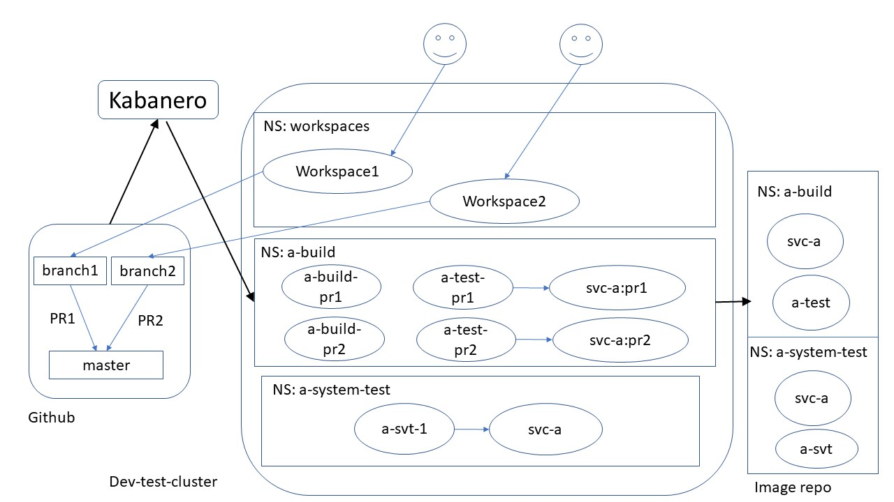
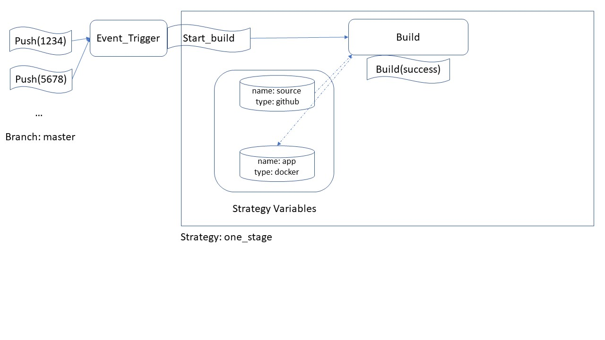
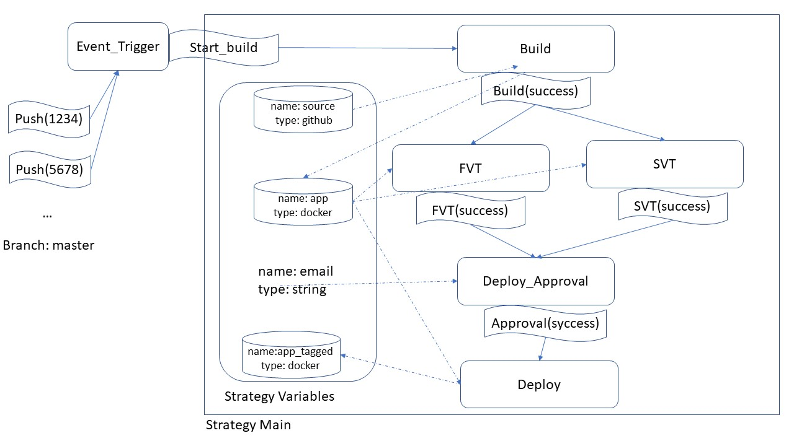
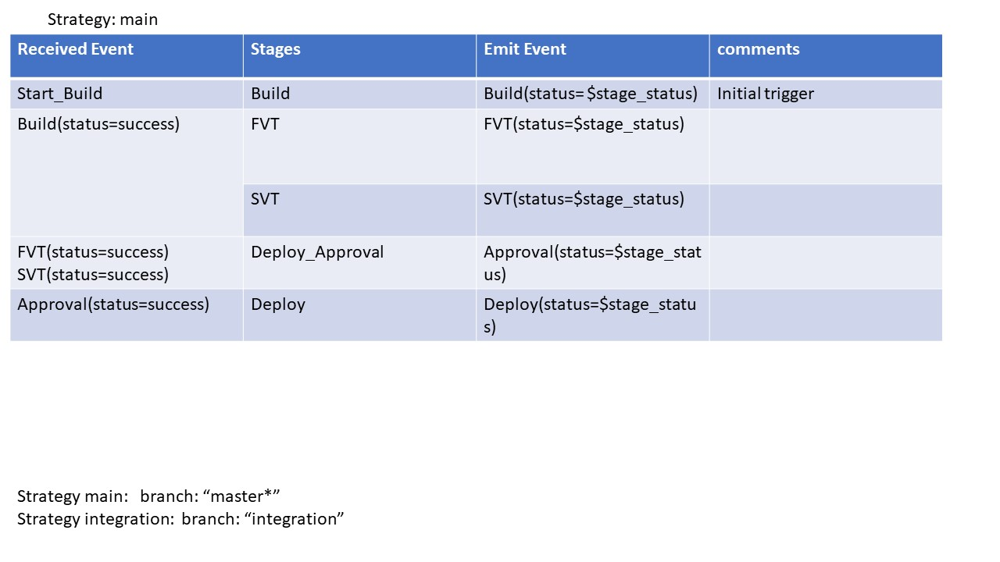

# Kabanero Event Architecture

## Table of Contents
* [Introduction](#Introduction)
* [What is Kabanero?](#What_is_Kabanero)
* [Kabanero High Level Usage Scenarios](#Usage_Scenarios)
* [Events Functional Specification](#Functional_Specification)


<a name="Introduction"></a>
## Introduction

This document contains the design of events in Kabanero. We start with an introduction to Kabanero and its value as a management infrastructure for cloud native devops. We then present the usage scenarios for Kabanero via three sample applications and their devops life cycle. This is followed by the functional specification of events to support the usage scenarios. 

<a name="What_is_Kabanero"></a>
## What is Kabanero?

The goal of Kabanero is to manage cloud native devops infrastructure. Such an infrastructure may contain many components (though not all are in the current Kabanero roadmap) :
- One or more developer environments. For example:
  - Appsody
  - Eclipse Che, or Openshift Codeready Workspaces
  - Eclipse with WDT on developer desktop. 
  - no IDE other than text editor
- One or more source control repositories. For Example:
  - Github
  - Gitlab
  - SVN
  - CVS
- One or more build/test pipeline technologies. For example:
  - Tekton, or Openshift Pipelines
  - Openshift Source-2-Image
  - Jenkins
- One or more stages in the continuous delivery pipeline. For example,
  - dev
  - test
  - integration
  - production

Kabanero supports separation of responsibilities. It allows a developer to concentrate as much on coding/testing inner loop as possible. A developer
- can stand up a standard development environment very quickly. For example, a developer may create a new stack from Appsody or Eclipse Che within minutes.
- Can rely on the environment to automatically trigger test builds before committing change into source control, with logs made available to the developer.
- Can rely on the environment to trigger additional release builds and run additional tests, and to be able to debug in the test environment when required.

At the same time, Kabanero allows a devops/solution architect to maintain and control the infrastructure to be made available the devops environment. The architect can define:
- Standardized development environments. For example:
  - Which stacks and versions are available for Appsody
  - Which stacks and versions are available for Eclipse Che or Openshift Codeready Workspaces.
- How to push an application/service through different build/test stages,  from source control repository to production. The architect defines:

  - What actions to take when source code is checked into source control. 
  - which Pipelines to execute
  - how to promote to the next stage of the pipeline

Kabanero automates the devops infrastructure as much as possible. It will
- offer easy to use defaults.
- Use organizational web hook to process events for all repositories within the organization when configured.
- Install and run the pipelines automatically when configured.
- Trigger new builds if the stack has been updated, for example, with security fixes.

Kabanero is secure. It supports:
  - login with different identity providers, for example, login with Github user ID, or with internal user registry
  - Role Based Access Control(RBAC) for different roles, for example, role of devops architect, and role of application developer.
  - security audit
  - automatic security scans for source code and binaries.

Kabanero is extensible. It can be enhanced to support:
- new development environments with new ways to create stacks,
- new source control repositories
- new pipeline technologies
- additional behavior based on internal events.

The initial version of Kabanero will support:
- Appsody as development environment
- Github for source repository 
- Tekton for pipeline

In order to ensure the design is extensible,  the remainder of this document covers more than one development environments, source control repositories, and pipeline technologies, even though some may not be in the current Kabanero roadmap.

<a name="Usage_Scenarios"></a>
## Kabanero High Level Usage Scenarios

This section captures the usage scenarios, from which we can derive the functional specification. We begin with a sample production environment consisting of 3 different applications/services. This is followed by discussion on the devops pipeline that produces the production environment. Note that the usage scenarios presented in this section are not recommendations. They are meant to capture a variety of scenarios to ensure the functional specification is sufficiently useful.

### The Production Environment

The production environment is in its own cluster `Prod-cluster`, and consists of 3 different applications:


The first application is an external facing UI application in the namespace ui-prod.  Its image is in the ui-prod namespace, and named ui. It depends on the service svc-a, and another service svc-b.

The second application is a microservice svc-a that is deployed in namespace a-prod. Its image is in the internal production repository, and in the namespace a-prod. This is a standalone shared service that may be called by other applications as well.  

The third and final application is a microservice svc-b. It is deployed in the namespace b-prod, with a corresponding images svc-b, and helper-b. The pod for svc-b runs both images svc-b and helper-b. 


### Usage Scenarios for ui

The `UI` application example is meant as a continuous deployment sample, where code in the `master` branch is always ready to deploy, and for this example, always deployed immediately. It follows a true cloud-native development process:
-  It uses Github or Github Enterprise as the source repository.  
- It uses the Github branching strategy:
  - Developers are required to create branches for all source code changes.
  - A pull request requires the following status checks before code may be merged back to `master`:
     - code review 
     - test build 
- A test build is triggered automatically for each pull request, and whenever a new commit is added to the pull request. Developer is not allowed to merge code without code review and successful test build. 
- The test build also runs automated tests.
- Developers use Appsody on their local machines as development environment.
- Builds from the `master` branch are automatically triggered when a Pull Request is merged into the `master` branch. If successfully, the new image is automatically deployed to production.


The pipeline is shown below:


#### Usage Scenario for Devops/Solution Architect

For the `ui` application, the developers use appsody as their local development environment. The architect is responsible for creating the Kabanero collection where the standardized appsody stacks are defined, and making the collection active for developer . **TBD**: Get link to docs.

The architect creates the Tekton Pipeline and Tasks for the `ui` application. This involves:
- Using any existing pipelines and tasks that may already be available for building node.js applications as the basis to create a new pipeline.
- Using any existing pipeline tasks for interacting with Github:
  - When build is kicked off, update the Github status check with a warning that build is on-going, to prevent the user from merging code. 
  - When build is successful,  additional Pipeline Tasks are used to install `ui-test`, `ui`, `svc-a` and `svc-b` images, and run the `ui-test` verification test.
- The last step of the pipeline is to record the github status and how to access the build. 
   - successful if all tasks succeed.
   - fail if some tasks fails

For the source repository, the architect:
- Creates the Github organizational functional IDs and webhook 
  - Finds the Kabanero Github event listener URL and secret to receive Github events: 
  - The Github events to be received are:
      - Pull Requests
- Creates the Kuberentes secrets required to access the repositories in the organization, depending on what is supported by the build pipeline, and Github: https://developer.github.com/v3/guides/managing-deploy-keys/. 
- Creates the `ui` repository under a Github organization. 
- Authorizes developers by adding them as collaborators.

The architect configures Kabanero what actions to take for pull request on an `ui` repository:
- Input: Github
  - Repository location: URL for the `ui` repository.
  - Event type: Pull Request. 
  - Option to Record Github status check for test build.
- Output: Docker
  - image location

The architect provides a second pipeline for building from the `master` branch. This pipeline is required to build the official image for production.
- The trigger for the pipeline is a new commit to `master` branch.
- If the build is successful, the new image is tagged as `latest`.
- The image is automatically deployed to production once tagged.


#### Usage Scenario for Developer

Prerequisites for the Developers:
- Developer installs Kabanero Client to local laptop/desktop
- Developer installs Appsody on laptop/desktop.  
- For local testing, the example shows re-deployment of svc-a and svc-b for every build. Other options are possible:
  - Use of stubs for svc-a and svc-b, 
  - or a working svc-a and svc-b service for local testing has been set up and made available for developers

The developer sets up a new environment for `ui` development as follows:
- Developer creates a branch and clones the branch into local environment.
- Developer logs into Kabanero
- Developer calls `appsody init Node.js --no-template` to initialize the node.js local development environment
- Developer inner loop:
   - Make code change
  - Call `appsody build`, or `appsody run`, or `appsody debug` as needed.
- Developer periodically pushes changes to the  branch.

When the developer is ready to merge to master:
- Developer creates a pull request, requesting code review from team member
  - A test build is automatically triggered. 
- Developer waits for status change on the Github checks:
   - code review approval
   - test build result
- When all status checks are successful, developer merges the change into `master`

If the test build is unsuccessful, developer receives an email from Github with instructions on how to access the build and tests.  
  - developer is given access to the build pod and test pod.


#### Kabanero Internals

Upon receipt of a PullRequest event from Github, the Kabanero listener posts a Github PullRequest event to the SourceRepository topic.

A built-in SourceRepository consumer listens for events on the SourceRepository topic. 
- It matches the repository URL to the repositories that have been configured. 
- It finds all the actions it is capable of handling for the event. In this case, the action is for starting a Tekton run
- It creates the Tekton Resources for the run, and starts the run.
- **TBD**:  resource management:
   - Number of concurrent runs
   - Garbage collection to remove old runs.

When code is merged into `master`, The Kabanero listener posts a Github Push event to the SoruceRepository topic. 
- A new run of the pipeline is started

### Usage Scenarios for svc-a



The second application, `svc-a`,  is meant to capture a more complex workflow for continuous delivery. In this workflow, code is delivered continuously. However, unlike the `ui` application, it is not continuously deployed to production.  It uses a branching strategy similar to `Git flow`.
- It was developed using Openshift Codeready Workspaces
- It uses Github or Github Enterprise as the source repository.  
- Developers are required to create branches or forks from `develop` branch for all source code changes. There may be many such branches, such as having a separate branch per feature or defect.
- A pull request requires the following status checks before code may be merged to `develop` branch:
   - code review 
   - test build 
- A test build is triggered automatically for each pull request, and whenever a new commit is added to the pull request. Developer is not allowed to merge code without code review and successful test build.
- A test build from the `develop` branch is kicked off from a timer and additional tests run to ensure the quality of the code.  For example, hourly or nightly. (Note: this is not yet shown in the diagram.) 
- Code is not merge to `master` branch from `develop` branch until it is ready for the next release, after system test.
- Code merged into `master` is tagged with version number, such as 1.0.0. 
- The pipeline to the system test is triggered manually for specific commits built from `develop`.

**Note:** This scenario also uses Openshift Pipelines, which is only available starting Openshift 4.

#### Functional Changes to Existing Software:

Kabanero operator changes:
- Install of Kabanero should not install Tekton. It should use pre-existing Openshift Pipelines based on Tekton.

Eclipse Che/Redhat Codeready Workspaces changes:
- Pick up predefined stacks from Kabanero

#### Usage Scenario for Devops/Solution Architect

For the `svc-a` application, the architect is responsible for creating the Kabanero collection where the standardized stacks are defined for Eclipse Che and made available to Eclipse Che. This may include existing stacks already available in Openshift Codeready Workspaces, and any additional.  **TBD**:
- How to ensure Eclipse che/Codeready Workspaces only pick up standardized stacks
- Do we want to prevent developers from creating their own stack?

The architect configures Github in the same way as for `ui` application. The main difference is the creation of `develop` integration branch. Developers may create their own feature or defect forks or branches.

The architect configures Tekton pipelines. The main difference is that there are additional pipeline for builds from `develop` branch, and for system test. Another difference is that many of the existing stacks in Codeready Workspaces can be built using existing source-2-image builders. The s2i step may be incorporated as part of the pipeline. See example here: https://github.com/openshift/pipelines-tutorial


#### Usage Scenario for Developer

The developer creates a workspace in Codeready workspaces:
- Login to Codeready Workspaces
- Select one of the predefined stacks
- Create a new workspace
- Configure the credentials required to access the Github `svc-a` repository
- Create a new branch
- Clone branch from Github

The developer code/debug inner loop:
- Make local code changes directly in Eclipse che
- Run unit test and debugs directly in Eclipse Che
- Push changes  to branch one or more times

The developer flow for creating the pull request is the same as that for the `ui` application.

### Usage Scenarios for svc-b

The purpose of the sample `svc-b` is to capture other scenarios currently out of scope. Possible scenarios, which may require adding additional applications, include:
- custom builds that produce more than one docker image.
- Builds that use the `docker` build strategy in openshift
- Builds that use the `jenkins` build strategy in openshift
- Builds that use the `s2i` build strategy in openshift, but does not use the Tekton pipeline.

**The details of these additional scenarios are TBD.** 


### Summary of the Usage Scenarios

#### What triggers a new run of pipeline

The following Github/GHE events may be configured to trigger a new run of the pipeline:
- Push: rebuild the repository up to the commits in the push.
- Pull request: Rebuild upstream repository merged with the commits in the pull request.

A new run may also be triggered on a timer. One example is an integration branch that is built nightly.

A new run may be triggered manually, for example, when manual action following approval is required to proceed to the next stage, or for system or long run tests.

A new run may be triggered when one or more dependent images changes. For example, an intermediate stage pipeline is triggered whenever one of its dependent images changes. The devops architect may define what is an `image change`. For example,
- whenever the SHA for the `latest` tag changes
- Whenever a new tag is created that matches a prescribed pattern, such as `3.0.0.1`

A new run may be triggered when the pipeline definition and its dependency changes. For example, 
- When the specification of the pipeline changes.
- When a builder image is modified to incorporate new versions of operating system, and prerequisite software.


#### Repository Specific Workflows

For Github and Github Enterprise:
- repository specific webhook
- organizational webhooks that covers multiple repositories within the organization.
- Updating pull request status check for builds

#### Support for existing Openshift technologies


**This is currently out of scope.**
- Build technologies:
  - s2i
  - Docker
  - Jenkins
- Runtimes
  - Read Hat runtimes and their corresponding builders. (Note: this likely is the same set of builders as last bullet. )
- Development:
  - Codeready Workspaces
- Pipelines:
  - Openshift Pipelines


<a name="Functional_Specification"></a>
## Events Functional Specification

Kabanero hosts an event infrastructure to allow system components to communicate with each other asynchronously. This enables an extensible framework whereby event topics, producers, and consumers may be added to implement additional system level function. 

One key component enabled by events is the Devops Strategy component, which allows the devops architect to link different devops stages via events to form a larger devops strategy. We will start with a sample usage scenario for a multi-stage devops strategy, and show how the stages are configured.  This is followed by more detailed design.

### Sample One Stage Build




1: Register Webhook

```
apiVersion: kabanero.io/v1alpha1
kind: GithubEventSource
metadata:
  name: user-hello-world-github
  namespace: kabanero
spec:
    url: https://github.com/user/hello-world
    apiSecret: user-hello-world-github-api
```

2. Webhook listener receives web hook POST and emits Push event


3. controller for StrategyTrigger receives Push Event. 

It uses StrategyTrigger CRD to do event filtering and variable substitution ang generate StrategyRun CRD:

```
apiVersion: kabanero.io/v1alpha1
kind: StrategyTrigger
metadata:
  name: one_stage
  namespace: kabanero
spec:
  - strategy: one_stage
  - events:
    - trigger:
       attribute: name
       value : Push
       filter:
          - attribute: branch
            allowed: master
            disallowed: *test
       variableBindings: 
          - name: source
            location: ${event.resource}
            branch: ${event.branch}
            commit: ${event.commit}
          - name: app
            location: ${docker_registry}/{$event.repoisotry}
        emit: 
          attribute: name
          value: Start_build
```


And the generated StrategyRun:
```
apiVersion: kabanero.io/v1alpha1
kind: StrategyRun
metadata:
  name: one_stage_201909030817000
  namespace: kabanero
spec:
  strategy: one_stage
  contextID: 201909030817000
  variables: 
    - name: source
      location: https://www.github.com/user/hello-world
      commit: 1234
    - name: app
      location: mydocker-registry.com/hello-world
  emit: 
    attribute: name
    value: Start_build
status:
    statue: in-progress
```

5. The controller for Strategy creates StageRun for each stage, and emits Start_build event:
```
apiVersion: kabanero.io/v1alpha1
kind: StageRun
metadata:
  name: appsody_build_201909030817000
  namespace: kabanero
spec:
  stageName: appsody_build
  stageKind: AppsodyBuildStage
  contextID: 201909030817000
  strategy_run: one_stage_201909030817000
status:
  state: in-progress
```

And this is the CRD for the One_stage strategy that is used to look up the stages:
```
apiVersion: kabanero.io/v1alpha1
kind: StrategyDefinition
metadata:
  name: one_stage
  namespace: kabanero
spec:
  - strategy_variables:
      - name: "source"
        type: "Github"
      - name: "app"
        type: "image"
  - stage_bindings:
    - stageName: appsody_build
      stageKind: AppsodyBuild
      resourceBindings:
        - inputBinding:
            - stageVariable: source
              strategyVariable: source
        - outputBinding:
            - stageVariable: image
              strategyVariable: app
      triggers:
          - attribute: name
            value: "Start_Build"
      emit:
        - event:
          - attribute: name
            value:  Build
          - attributge: status
            value: $stage_status
```

And this is the CRD for AppsodyBuild stage:
```
apiVersion: kabanero.io/v1alpha1
kind: AppsodyBuild
metadata:
  name: appsody_build
  namespace: kabanero
spec:
  resources:
    input:
      - name: source
        type: github
    output:
      - name: image
        type: docker
```

6. The controller for AppsodyBuild uses StageRun and StrategyRun to listen for the events, and find the values of its variables to generate Tekton PipelineResource and PipelineRun to start the build.


On next PUsh to github, Push(5678) is received:

```
apiVersion: kabanero.io/v1alpha1
kind: StrategyRun
metadata:
  name: one_stage_201909031252000
  namespace: kabanero
spec:
  strategy: one_stage
  contextID: 201909031252000
  variables: 
    - name: source
      location: https://www.github.com/user/hello-world
      commit: 5678
    - name: app
      location: mydocker-registry.com/hello-world
  emit: 
    attribute: name
    value: Start_build
status:
    statue: in-progress
```

The controller for StrategyRun also creates a run for each stage.  For example:

```
apiVersion: kabanero.io/v1alpha1
kind: StageRun
metadata:
  name: appsody_build_201909031252000
  namespace: kabanero
spec:
  stageName: appsody_build
  stageKind: AppsodyBuild
  contextID: 201909031252000
  strategy_run: one_stage_201909031252000
status:
  state: in-progress
```

The Appsody Stage controller creates TektonResource and PipelineRun to start the run.


### Sample Multi-stage Devops Strategy

Shown in the diagram below is a sample Devops Strategy involving multiple stages: 



The sample strategy is defined by the devops architect, and is consist of:
- A build stage that performs an appsody build
- If the build succeeds, two additional stages are run in parallel: FVT and SVT, which are both Tekton pipelines.
- Once both stages complete successfully, a `Deploy_Approval` stage is used to get manual approval. This stage is implemented via custom code.
- Once approved, the `Deploy` stage is used to perform deployment via another Tekton pipeline.

Each of these stages is triggered by one or more events, and emits additional events upon completion of the stage. Note that:
- Parallel operations are possible when one event trigger more than one subsequent stages, such as FVT and SVT.
- A stage may be triggered by more than one event, supporting "AND" relationship, such as Deploy_Approval.
- Currently  the `OR` relationship is not yet defined, where a stage may be triggered by one of many events. 
- Circular loop across stages is also not yet undefined.
- Though not shown, compensation stages may be defined by with events for failed stages.


Each stage defines a set of input and output resources. Variables at the strategy level may be used to bind to resources at each of the stages. For example,
- the `source` variable resolves to the input repository of the `Build` stage.
- the `app` variable resolves to the output resource of the `Build` stage, and input resources of the `FVT`, `SVT`, and `Deploy` stages.
- The `email` variable resolves to the input of the `Deploy_Approved` state.
- The `app_tagged` variable resolves to the output resource of the `Deploy` stage.

A strategy is activated by defining external events to trigger its execution. In our sample, it is activated by Push events created as a result of push to a github repository.  Each Push event initiates a new instance of the strategy.

### Configuring Sample Strategy

Another way to express the sample strategy is via a state diagram that look like:



The devops architect defines the strategy as follows:
- Choose the lower level processes that will make up each stage. Examples include Tekton pipeline, and custom code.
- Define the strategy event triggers for each stage, and the output strategy events
- Define the mapping of strategy wide variables to per-stage variables.

The devops architect activates the strategy by defining external event triggers (such as Push), and mapping of external events to actual values in strategy side variables.


#### Incorporating Stages into a Strategy

A `stage` implements a specific devops operation, may contain input/output resources, and is configured via a custom resource. Kabanero comes with a set of pre-defined stages, which include:
- A stage to perform appsody build
- A stage to run arbitrary Tekton pipeline

 In addition, the framework is extensible to allow custom stages to be deployed.  The devops architect incorporates the stages needed to implement the strategy.


For our sample, the architect picks the following stages:

##### Build stage

The build stage uses the following built-in StageDefinition:

```
apiVersion: kabanero.io/v1alpha1
kind: AppsodyBuild
metadata:
  name: appsody_build
  namespace: kabanero
spec:
  resources:
    input:
      - name: source
        type: github
    output:
      - name: image
        type: docker
```

The implementation of the Appsody build stage does the following:
- Fetch `appsody-config.yaml` from the `source` repository
- Find the value of the `stack` attribute in `appsody-config.yaml`, for example, `appsody/node-js:0.2.2.`
- Find matching collection using exact match
- Find build pipeline for the given stack that matches `pipeline` variable.
- Builds the application image and stores it under `image`

**TBD:**: If there are more than 1 build pipeline per collection, will need a new variable to track which pipeline to use.

##### FVT stage

The FVT stage uses a Tekton pipeline stage that is not associated with a collection.  It specifies the name and namespace of the pipeline. The input/output resources of the stage are the same as the pipeline. 

```
apiVersion: kabanero.io/v1alpha1
kind: TektonStage
metadata:
  name: FVT
  namespace: kabanero
spec:
  resources:
    input:
      - name: image
        type: docker
  pipelineName: TEST
  pipelineNamespace kabanero
```

##### SVT Stage

The SVT stage makes use of another Tekton pipeline.  

```
apiVersion: kabanero.io/v1alpha1
kind: TektonStage
metadata:
  name: SVT
  namespace: kabanero
spec:
  resources:
    input:
      - name: image
        type: docker
  pipelineName: SYSTEM_TEST
  pipelineNamespace kabanero
```

##### Approval Stage

For the purpose of this sample, the Approval Stage is a custom stage  installed by the devops architect. It requires an input variable `approvers`, for the email address of the approvers. Its function is to send email to list of approvers, and to update the status of the approval once one of the approvers replies with approval.

```
apiVersion: kabanero.io/v1alpha1
kind: EamilApprovalStage
metadata:
  name: deploy_approval
  namespace: kabanero
spec:
  resources:
    input:
      - name: approvers
        type: string
```

##### Deploy Stage

The Deploy stage makes use of another Tekton pipeline:

```
apiVersion: kabanero.io/v1alpha1
kind: TektonStage
metadata:
  name: deploy
  namespace: kabanero
spec:
  resources:
    input:
      - name: app
        type: docker
    output:
      - name: app_tagged
        type: docker
  pipelineName: Deploy
  pipelineNamespace kabanero
```


#### Defining a Strategy 

To describe how the different stages are to work together, the devops architect creates the StrategyDefinition, which contains:
- strategy wide variables 
- Binding of strategy wide variables to per-stage resources
- Event triggers for each stage
- Events emitted for each stage.

Here is an example:

```
apiVersion: kabanero.io/v1alpha1
kind: StrategyDefinition
metadata:
  name: main
  namespace: kabanero
spec:
  - strategy_variables:
      - name: "src_repo"
        type: "Github"
      - name: "app_image"
        type: "image"
      - name: "app_image_tagged"
        type: "image"
      - name: approver_emails
        type: string
  - stage_bindings:
    - stageName: appsody_build
      stageKind: AppsodyBuild
      resourceBindings:
        - inputBinding:
            - stageVariable: source
              strategyVariable: repo
        - outputBinding:
            - stageVariable: image
              strategyVariable: app
      triggers:
          - attribute: name
            value: "Start_Build"
      emit:
        - event:
          - attribute: name
            value:  Build
          - attributge: status
            value: $stage_status
    - stageName: FVT
      stageKind: TektonStage
      resourceBindings:
        - inputBinding:
           - stageVaraible: image
             strategyVariable: app_image
      triggers:
          - attribute: name
            value: "Build"
          - attribute: status
            value: "Success"
      emit:
        - event:
          - attribute: name
            value:  FVT
          - attributge: status
            value: $stage_status
    - stageName: SVT
      stageKind: TektonStage
      name: SVT
      resourceBindings:
        - inputBinding:
           - stageVaraible: image
             strategyVariable: app_image
      triggers:
          - attribute: name
            value: "Build"
          - attribute: status
            value: "Success"
      emit:
        - event:
          - attribute: name
            value:  SVT
          - attributge: status
            value: $stage_status
    - stageName: Approval
      stageKind: EmailApprovalStage
      triggers:
          - trigger
            - attribute: name
              value: "FVT"
            - attribute: status
              value: "Success"
          - trigger
            - attribute: name
              value: "SVT"
            - attribute: status
              value: "Success"
      emit:
        - event:
          - attribute: name
            value:  Deploy
          - attributge: status
            value: $stage_status
    - stageName: Deploy
      stageKind: TektonStage
      resourceBindings:
        - outputBinding:
           - stageVaraible: image
             strategyVariable: app_image_tagged
      triggers:
          - trigger
            - attribute: name
              value: "deploy_approval"
            - attribute: status
              value: "Success"
      emit:
        - event:
          - attribute: name
            value:  Deploy
          - attributge: status
            value: $stage_status
```


#### Strategy Trigger

A strategy trigger defines an external trigger for the strategy:

```
apiVersion: kabanero.io/v1alpha1
kind: StrategyTrigger
metadata:
  name: main
  namespace: kabanero
spec:
  - strategy: main
  - events:
    - trigger:
       attribute: name
       value : Push
       filter:
          - attribute: branch
            allowed: master
            disallowed: *test
       variableBindings: 
          - name: src_repo
            location: $event.resource
            branch: ${event.branch}
            commit: ${event.commit}
          - name: app_image
            location: ${docker_registry}/{$event.repoisotry}
          - name: app_image_tagged
            location: ${docker_registry}/${event.repository}:${event.commit}
          - name: approver_emails
            value: "champ@mycompany.com"
        emit: 
          attribute: name
          value: Start_build
```

#### Strategy Runs

Each trigger of the strategy creates a running strategy instance. Strategy Runs may also be created manually. 

```
apiVersion: kabanero.io/v1alpha1
kind: StrategyRun
metadata:
  name: main_201909030817000
  namespace: kabanero
spec:
  strategy: main
  contextID: 201909030817000
  variables: 
    - name: src_repo
      location: https://www.github.com/user/hello-world
      commit: 12345
    - name: app_image
      location: mydocker-registry.com/hello-world
    - name: app_image_tagged
      location: mydocker-registry.com/hello-world:12345
    - name: approver_emails
      value: "champ@mycompany.com"
  emit: 
    attribute: name
    value: Start_build
```

The controller for StrategyRun also creates a run for each stage.  For example:

```
apiVersion: kabanero.io/v1alpha1
kind: StageRun
metadata:
  name: appsody_build_201909030817000
  namespace: kabanero
spec:
  stageName: appsody_build
  stageKind: AppsodyBuildStage
  contextID: 201909030817000
  strategy_run: main_201909030817000
```

The controller for each stage processes the creation of StageRun by:
- listening for event triggers for the stage. 
- After trigger, perform the actions of the stage by creating and running additional resources, such as Tekton pipeline
- Emit completion events after completion of the action.

#### Status of Strategy Runs

Each of the StrategyRun and StageRun resource is expected to update the status of the run. For example,

```
apiVersion: kabanero.io/v1alpha1
kind: StrategyRun
metadata:
  name: main_123456
  namespace: kabanero
spec:
  strategy: main
  contextID: 201909030817000
  variableBindings: 
    - name: src_repo
      location: https://www.github.com/user/hello-world
      commit: 12345
    - name: app_image
      location: mydocker-registry.com/hello-world
    - name: app_image_tagged
      location: mydocker-registry.com/hello-world:12345
    - name: approver_emails
      value: "champ@mycompany.com"
  emit: 
    attribute: name
    value: Start_build
  status:
    state: in-pgoress
    stages:
      - stage: Build
        status: success
      - stage: FVT
        status: failed

```

```
apiVersion: kabanero.io/v1alpha1
kind: StageRun
metadata:
  name: appsody_build_abcdefg12345
  namespace: kabanero
spec:
  stage: appsody_build
  contextID: 201909030817000
  strategy_run: main_123456
status:
  status: Success
```

#### Tracking context

Each run of the strategy and the associated stages is under a different context.  The contextID is created and stored as part of each StrategyRun and StageRun resource.  In addition, the contextID is an implicit attribute stored within each intra-strategy event (such as Build, FVT, etc). This allows the implementations of each stage to distinguish between different runs. 

#### Adding a Custom Stage

The first step to creating a custom stage is to define a custom resource for the stage. The custom resource must contain the declarations of the with the input and output resources, but may contain more configuration attributes for the particular stage.  Say we wish to define a stage that builds 3 different platforms. Its custom resource definition may look like:

```
apiVersion: kabanero.io/v1alpha1
kind: MultiPlatformBuild
metadata:
  name: multi-platform-build
  namespace: kabanero
spec:
  resources:
    input:
      - name: source
        type: github
    output:
      - name: image_amd64
        type: docker
      - name: image_ppcl3
        type: docker
      - name: image_os390
        type: docker
```

The next step is to develop a Kubernetes controller that reacts to changes to the StageRun resource. Upon the creation of the StageRun resource, the controller will
- determine whether it needs to handle the run by matching the stage in the Strategy resource.
- If it needs to handle the run
  - Start to listen for trigger event
  - Once triggered, carry out action of the stage
  - When action is completed, emit end of action event.

If the StageRun resource is deleted, the controller cancels any ongoing action, and stops to listen for trigger events.

**TBD: A stage development library will be useful**


### Webhook Setup

To set up web hooks to github, create and apply a GithubEventSource. Here is an example for setting up an organizational web hook:

```
apiVersion: kabanero.io/v1alpha1
kind: GithubEventSource
metadata:
  name: myorg-github
  namespace: kabanero
spec:
    url: https://github.com/enterprises/myorg
    apiSecret: myorg-github-api
```

Here is an example to set up a per-repository web hook to Github as an event source. 

```
apiVersion: kabanero.io/v1alpha1
kind: GithubEventSource
metadata:
  name: user-hello-world-github
  namespace: kabanero
spec:
    url: https://github.com/user/hello-world
    apiSecret: user-hello-world-github-api
```

The status of the event source shows whether the web hook was configured. For example:
```
apiVersion: kabanero.io/v1alpha1
kind: GithubEventSource
metadata:
  name: myorg-github
  namespace: kabanero
spec:
    url: https://github.com/enterprises/myorg
    apiSecret: myorg-github-api
status:
  configured: true
  message: "web hook created for https://github.com/entgerprise/myorg with web hook URL: https://my-openshift-cluster/kabanero/webhook using secret  defaul-kabanero-webhook-secret"
```

#### Kabanero web hook Listener

When source is pushed to Github, or when a PullRequest is created, the Kabanero web hook listener receives a POST request from github, and emits a `SourceRepository` event to the `/kabanero/SourceRepository` topic,  where `kabanero` is the kabanero instance name.  For example, the event for a push  may be:

```
- repositoryType: Github
- eventName: Push
- location: https://github.com/myorg/hello-world
- branch: master
- sha: 1234567
- rawData: JSON of the request
```
**TBD: How much filtering for the raw data.**

An event for a PullRequest may be:

```
- repositoryType: Github
- eventName: PullRequest
- location: https://github.com/myorg/hello-world
- action: action associated with pull request
- branch: master
- rawData: JSON of the request
```


### Event Topics

#### Topic: SourceRepository

The attributes:
- repositoryType : type of repository, currently only `Github`
- eventName: The name of the event in the repository, currently only `Push` and `PullRequest`.
- location: The location of the repository
- rawData: The actual JSON object coming from the repository, or a mapping of the data if original data is not JSON

#### Topic: KabaneroManagement

The attributes:
- eventName: one of `list`, `login`, `logout`, `onboard`, `refresh`
- user: The ID of the user who initiated the call
- status: The status of the API call
- **TBD**: API specific parameters

#### Topic: KabaneroClient

The attributes of the events are:
- eventName: one of `login`, `logout`, etc
- user: The ID of the user who initiated the call
- status: The status of the API call
- **TBD**: API specific parameters

#### Topic: KubernetesAPI

The attributes are:
- eventType: One of `create`, `modify`, and `delete`
- kind: kind of the resource
- namespace: namespace of the resource, if resource is namespaced
- name: name of the resource
- resource: JSON specification of a Kubernetes resource
- oldResource: for `modify` event type, JSON specification of the old resource.
  
Filters may be defined on the resources through a ConfigMap whose name is kabanero.kubernetes.api.event.filter. The filter for namespaced resources is based on namespace, and filter for resources without namespace is based Kind. If the Configmap is not defined, it is equivalent to:
```
apiVersion: kabanero.io/v1alpha1
kind: ConfigMap
metadata:
  name: kaganero.kubernetes.api.event.filter
  namespace: kabanero
spec:
  data:
    allowedNamespaces:
      - *
    disAllowedNoNamespacedKinds:
      - *
```

Here is an example with more extensive specification:
```
apiVersion: kabanero.io/v1alpha1
kind: ConfigMap
metadata:
  name: kaganero.kubernetes.api.event.filter
  namespace: kabanero
spec:
  data:
    allowedNamespaces:
      - app1*
      - app2*
    disallowedNamespaces:
      - *temp
    allowedNoNamespacedKinds:
      - kind1*
      - kind2*
```

A namespaced resource whose namespace is allowed by `allowedNamespaces` filter, and is not disallowed by the `disallowedNamespaces` passed the filter.  A resource without namespace whose kind is allowed by allowedNoNamespacedKinds and not disallowed by the disallowedNoNamespacedKind passes the filter.

Note: For security reasons, Kubernetes Secrets are not stored in the `resource` or `oldResource` attributes of the KubernetesAPI event.

#### Topic: KabaneroOperator

**TBD: Kabanero Operator related events**

