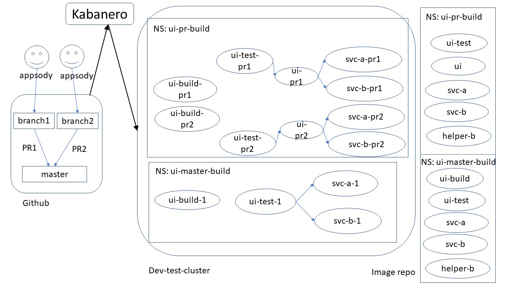

# Kabanero Event Architecture

## Table of Contents
* [Introduction](#Introduction)
* [What is Kabanero?](#What_is_Kabanero)
* [Kabanero High Level Usage Scenarios](#Usage_Scenarios)
* [Events Functional Specification](#Functional_Specification)


<a name="Introduction"></a>
## Introduction

This document contains the design of events in Kabanero. We start with an introduction to Kabanero and its value as a management infrastructure for cloud native devops. We then present the usage scenarios for Kabanero via three sample applications and their devops life cycle. This is followed by the functional specification of events to support the usage scenarios. 

<a name="What_is_Kabanero"></a>
## What is Kabanero?

The goal of Kabanero is to manage cloud native devops infrastructure. Such an infrastructure may contain many components (though not all are in the current Kabanero roadmap) :
- One or more developer environments. For example:
  - Appsody
  - Eclipse Che, or Openshift Codeready Workspaces
  - Eclipse with WDT on developer desktop. 
  - no IDE other than text editor
- One or more source control repositories. For Example:
  - Github
  - Gitlab
  - SVN
  - CVS
- One or more build/test pipeline technologies. For example:
  - Tekton, or Openshift Pipelines
  - Openshift Source-2-Image
  - Jenkins
- One or more stages in the continuous delivery pipeline. For example,
  - dev
  - test
  - integration
  - production

Kabanero supports separation of responsibilities. It allows a developer to concentrate as much on coding/testing inner loop as possible. A developer
- can stand up a standard development environment very quickly. For example, a developer may create a new stack from Appsody or Eclipse Che within minutes.
- Can rely on the environment to automatically trigger test builds before committing change into source control, with logs made available to the developer.
- Can rely on the environment to trigger additional release builds and run additional tests, and to be able to debug in the test environment when required.

At the same time, Kabanero allows a devops/solution architect to maintain and control the infrastructure to be made available the devops environment. The architect can define:
- Standardized development environments. For example:
  - Which stacks and versions are available for Appsody
  - Which stacks and versions are available for Eclipse Che or Openshift Codeready Workspaces.
- How to push an application/service through different build/test stages,  from source control repository to production. The architect defines:

  - What actions to take when source code is checked into source control. 
  - which Pipelines to execute
  - how to promote to the next stage of the pipeline

Kabanero automates the devops infrastructure as much as possible. It will
- offer easy to use defaults.
- Use organizational web hook to process events for all repositories within the organization when configured.
- Install and run the pipelines automatically when configured.
- Trigger new builds if the stack has been updated, for example, with security fixes.

Kabanero is secure. It supports:
  - login with different identity providers, for example, login with Github user ID, or with internal user registry
  - Role Based Access Control(RBAC) for different roles, for example, role of solution architect, and role of application developer.
  - security audit
  - automatic security scans for source code and binaries.

Kabanero is extensible. It can be enhanced to support:
- new development environments with new ways to create stacks,
- new source control repositories
- new pipeline technologies
- additional behavior based on internal events.

The initial version of Kabanero will support:
- Appsody as development environment
- Github for source repository 
- Tekton for pipeline

In order to ensure the design is extensible,  the remainder of this document covers more than one development environments, source control repositories, and pipeline technologies, even though some may not be in the current Kabanero roadmap.

<a name="Usage_Scenarios"></a>
## Kabanero High Level Usage Scenarios

This section captures the usage scenarios, from which we can derive the functional specification. We begin with a sample production environment consisting of 3 different applications/services. This is followed by discussion on the devops pipeline that produces the production environment. Note that the usage scenarios presented in this section are not recommendations. They are meant to capture a variety of scenarios to ensure the functional specification is sufficiently useful.

### The Production Environment

The production environment is in its own cluster `Prod-cluster`, and consists of 3 different applications:


The first application is an external facing UI application in the namespace ui-prod.  Its image is in the ui-prod namespace, and named ui. It depends on the service svc-a, and another service svc-b.

The second application is a microservice svc-a that is deployed in namespace a-prod. Its image is in the internal production repository, and in the namespace a-prod. This is a standalone shared service that may be called by other applications as well.  

The third and final application is a microservice svc-b. It is deployed in the namespace b-prod, with a corresponding images svc-b, and helper-b. The pod for svc-b runs both images svc-b and helper-b. 


### Usage Scenarios for ui

The `UI` application example is meant as a continuous deployment sample, where code in the `master` branch is always ready to deploy, and for this example, always deployed immediately. It follows a true cloud-native development process:
-  It uses Github or Github Enterprise as the source repository.  
- It uses the Github branching strategy:
  - Developers are required to create branches for all source code changes.
  - A pull request requires the following status checks before code may be merged back to `master`:
     - code review 
     - test build 
- A test build is triggered automatically for each pull request, and whenever a new commit is added to the pull request. Developer is not allowed to merge code without code review and successful test build. 
- The test build also runs automated tests.
- Developers use Appsody on their local machines as development environment.
- Builds from the `master` branch are automatically triggered when a Pull Request is merged into the `master` branch. If successfully, the new image is automatically deployed to production.


The pipeline is shown below:




#### Usage Scenario for Devops/Solution Architect

For the `ui` application, the developers use appsody as their local development environment. The architect is responsible for creating the Kabanero collection where the standardized appsody stacks are defined, and making the collection active for developer . **TBD**: Get link to docs.

The architect creates the Tekton Pipeline and Tasks for the `ui` application. This involves:
- Using any existing pipelines and tasks that may already be available for building node.js applications as the basis to create a new pipeline.
- Using any existing pipeline tasks for interacting with Github:
  - When build is kicked off, update the Github status check with a warning that build is on-going, to prevent the user from merging code. 
  - When build is successful,  additional Pipeline Tasks are used to install `ui-test`, `ui`, `svc-a` and `svc-b` images, and run the `ui-test` verification test.
- The last step of the pipeline is to record the github status and how to access the build. 
   - successful if all tasks succeed.
   - fail if some tasks fails

For the source repository, the architect:
- Creates the Github organizational functional IDs and webhook 
  - Finds the Kabanero Github event listener URL and secret to receive Github events: 
  - The Github events to be received are:
      - Pull Requests
- Creates the Kuberentes secrets required to access the repositories in the organization, depending on what is supported by the build pipeline, and Github: https://developer.github.com/v3/guides/managing-deploy-keys/. 
- Creates the `ui` repository under a Github organization. 
- Authorizes developers by adding them as collaborators.

The architect configures Kabanero what actions to take for pull request on an `ui` repository:
- Input: Github
  - Repository location: URL for the `ui` repository.
  - Event type: Pull Request. 
  - Option to Record Github status check for test build.
- Output: Docker
  - image location

The architect provides a second pipeline for building from the `master` branch. This pipeline is required to build the official image for production.
- The trigger for the pipeline is a new commit to `master` branch.
- If the build is successful, the new image is tagged as `latest`.
- The image is automatically deployed to production once tagged.


#### Usage Scenario for Developer

Prerequisites for the Developers:
- Developer installs Kabanero Client to local laptop/desktop
- Developer installs Appsody on laptop/desktop.  
- For local testing, the example shows re-deployment of svc-a and svc-b for every build. Other options are possible:
  - Use of stubs for svc-a and svc-b, 
  - or a working svc-a and svc-b service for local testing has been set up and made available for developers

The developer sets up a new environment for `ui` development as follows:
- Developer creates a branch and clones the branch into local environment.
- Developer logs into Kabanero
- Developer calls `appsody init Node.js --no-template` to initialize the node.js local development environment
- Developer inner loop:
   - Make code change
  - Call `appsody build`, or `appsody run`, or `appsody debug` as needed.
- Developer periodically pushes changes to the  branch.

When the developer is ready to merge to master:
- Developer creates a pull request, requesting code review from team member
  - A test build is automatically triggered. 
- Developer waits for status change on the Github checks:
   - code review approval
   - test build result
- When all status checks are successful, developer merges the change into `master`

If the test build is unsuccessful, developer receives an email from Github with instructions on how to access the build and tests.  
  - developer is given access to the build pod and test pod.


#### Kabanero Internals

Upon receipt of a PullRequest event from Github, the Kabanero listener posts a Github PullRequest event to the SourceRepository topic.

A built-in SourceRepository consumer listens for events on the SourceRepository topic. 
- It matches the repository URL to the repositories that have been configured. 
- It finds all the actions it is capable of handling for the event. In this case, the action is for starting a Tekton run
- It creates the Tekton Resources for the run, and starts the run.
- **TBD**:  resource management:
   - Number of concurrent runs
   - Garbage collection to remove old runs.

When code is merged into `master`, The Kabanero listener posts a Github Push event to the SoruceRepository topic. 
- A new run of the pipeline is started

### Usage Scenarios for svc-a


The second application, `svc-a`,  is meant to capture a more complex workflow for continuous delivery. In this workflow, code is delivered continuously. However, unlike the `ui` application, it is not continuously deployed to production.  It uses a branching strategy similar to `Git flow`.
- It was developed using Openshift Codeready Workspaces
- It uses Github or Github Enterprise as the source repository.  
- Developers are required to create branches or forks from `develop` branch for all source code changes. There may be many such branches, such as having a separate branch per feature or defect.
- A pull request requires the following status checks before code may be merged to `develop` branch:
   - code review 
   - test build 
- A test build is triggered automatically for each pull request, and whenever a new commit is added to the pull request. Developer is not allowed to merge code without code review and successful test build.
- A test build from the `develop` branch is kicked off from a timer and additional tests run to ensure the quality of the code.  For example, hourly or nightly. (Note: this is not yet shown in the diagram.) 
- Code is not merge to `master` branch from `develop` branch until it is ready for the next release, after system test.
- Code merged into `master` is tagged with version number, such as 1.0.0. 
- The pipeline to the system test is triggered manually for specific commits built from `develop`.

**Note:** This scenario also uses Openshift Pipelines, which is only available starting Openshift 4.

#### Functional Changes to Existing Software:

Kabanero operator changes:
- Install of Kabanero should not install Tekton. It should use pre-existing Openshift Pipelines based on Tekton.

Eclipse Che/Redhat Codeready Workspaces changes:
- Pick up predefined stacks from Kabanero

#### Usage Scenario for Devops/Solution Architect

For the `svc-a` application, the architect is responsible for creating the Kabanero collection where the standardized stacks are defined for Eclipse Che and made available to Eclipse Che. This may include existing stacks already available in Openshift Codeready Workspaces, and any additional.  **TBD**:
- How to ensure Eclipse che/Codeready Workspaces only pick up standardized stacks
- Do we want to prevent developers from creating their own stack?

The architect configures Github in the same way as for `ui` application. The main difference is the creation of `develop` integration branch. Developers may create their own feature or defect forks or branches.

The architect configures Tekton pipelines. The main difference is that there are additional pipeline for builds from `develop` branch, and for system test. Another difference is that many of the existing stacks in Codeready Workspaces can be built using existing source-2-image builders. The s2i step may be incorporated as part of the pipeline. See example here: https://github.com/openshift/pipelines-tutorial


#### Usage Scenario for Developer

The developer creates a workspace in Codeready workspaces:
- Login to Codeready Workspaces
- Select one of the predefined stacks
- Create a new workspace
- Configure the credentials required to access the Github `svc-a` repository
- Create a new branch
- Clone branch from Github

The developer code/debug inner loop:
- Make local code changes directly in Eclipse che
- Run unit test and debugs directly in Eclipse Che
- Push changes  to branch one or more times

The developer flow for creating the pull request is the same as that for the `ui` application.

### Usage Scenarios for svc-b

The purpose of the sample `svc-b` is to capture other scenarios currently out of scope. Possible scenarios, which may require adding additional applications, include:
- custom builds that produce more than one docker image.
- Builds that use the `docker` build strategy in openshift
- Builds that use the `jenkins` build strategy in openshift
- Builds that use the `s2i` build strategy in openshift, but does not use the Tekton pipeline.

**The details of these additional scenarios are TBD.** 


### Summary of the Usage Scenarios

#### What triggers a new run of pipeline

The following Github/GHE events may be configured to trigger a new run of the pipeline:
- Push: rebuild the repository up to the commits in the push.
- Pull request: Rebuild upstream repository merged with the commits in the pull request.

A new run may also be triggered on a timer. One example is an integration branch that is built nightly.

A new run may be triggered manually, for example, when manual action following approval is required to proceed to the next stage, or for system or long run tests.

A new run may be triggered when one or more dependent images changes. For example, an intermediate stage pipeline is triggered whenever one of its dependent images changes. The devops architect may define what is an `image change`. For example,
- whenever the SHA for the `latest` tag changes
- Whenever a new tag is created that matches a prescribed pattern, such as `3.0.0.1`

A new run may be triggered when the pipeline definition and its dependency changes. For example, 
- When the specification of the pipeline changes.
- When a builder image is modified to incorporate new versions of operating system, and prerequisite software.


#### Repository Specific Workflows

For Github and Github Enterprise:
- repository specific webhook
- organizational webhooks that covers multiple repositories within the organization.
- Updating pull request status check for builds

#### Support for existing Openshift technologies

**This is currently out of scope.**
- Build technologies:
  - s2i
  - Docker
  - Jenkins
- Runtimes
  - Read Hat runtimes and their corresponding builders. (Note: this likely is the same set of builders as last bullet. )
- Development:
  - Codeready Workspaces
- Pipelines:
  - Openshift Pipelines


<a name="Functional_Specification"></a>
## Events Functional Specification

Kabanero hosts an event infrastructure to allow system components to communicate with each other asynchronously. This enables an extensible framework whereby event topics, producers, and consumers may be added to implement additional system level function. 

The built-in event topics include:
- SourceRepository topic with events related to changes in source code repository.
- KabaneroManagement topic with Kabanero Management API related events.
- KabaneroClient topic with Kabanero Client API related events.
- KubernetesAPI topic with Kubernetes API related events.
- Pipeline topic with events related to pipeline execution.

The built-in event consumers include:
- A SourceRepository events consumer that initiates pipeline runs.
- A Pipeline status consumer that listens for KubernetesAPI events, and emits Pipeline events.

Additional use cases may be added in the future. For example, 
- Support additional source repositories and pipelines
- Report status of various components to a slack channel
- Sending urgent notifications to a user


### Build Pipeline Scenario 

In this section, we present the first use cases to be supported via events, which is triggering build pipelines. Let's first describe how a web hook is configured, and what happens from commit to the source repository to initiating a build.

#### Configuring web hook

To set up web hooks to github, create and apply a GithubEventSource. Here is an example for setting up an organizational web hook:

```
apiVersion: kabanero.io/v1alpha1
kind: GithubEventSource
metadata:
  name: myorg-github
  namespace: kabanero
spec:
    url: https://github.com/enterprises/myorg
    apiSecret: myorg-github-api
```

Here is an example to set up a per-repository web hook to Github as an event source. 

```
apiVersion: kabanero.io/v1alpha1
kind: GithubEventSource
metadata:
  name: user-hello-world-github
  namespace: kabanero
spec:
    url: https://github.com/user/hello-world
    apiSecret: user-hello-world-github-api
```

The status of the event source shows whether the web hook was configured. For example:
```
apiVersion: kabanero.io/v1alpha1
kind: GithubEventSource
metadata:
  name: myorg-github
  namespace: kabanero
spec:
    url: https://github.com/enterprises/myorg
    apiSecret: myorg-github-api
status:
  configured: true
  message: "web hook created for https://github.com/entgerprise/myorg with web hook URL: https://my-openshift-cluster/kabanero/webhook using secret  defaul-kabanero-webhook-secret"
```

#### Kabanero web hook Listener

When source is pushed to Github, or when a PullRequest is created, the Kabanero web hook listener receives a POST request from github, and emits a `SourceRepository` event to the `/kabanero/SourceRepository` topic,  where `kabanero` is the kabanero instance name.  For example, the event for a push  may be:

```
- repositoryType: Github
- eventName: Push
- location: https://github.com/myorg/hello-world
- branch: master
- sha: 1234567
- rawData: JSON of the request
```
**TBD: How much filtering for the raw data.**

An event for a PullRequest may be:

```
- repositoryType: Github
- eventName: PullRequest
- location: https://github.com/myorg/hello-world
- action: action associated with pull request
- branch: master
- rawData: JSON of the request
```

#### Kabanero Repository event Listener

The Kabanero Repository event listener receives the event, and creates a new KabaneroRun CRD instance to start the build. The KabaneroRun CRD makes it easy to initiate a new build, no matter how it's triggered. It only requires input identifying which part of source code to build. Underneath the covers, it matches the source code to pre-configure build pipeline, and starts the build.

Here is an example for a `Push`:
```
apiVersion: kabanerio.io/v1alpha1
    name: hello-world-1234567-1
    Kind: KabaneroRun
    spec:
        type: github
        repository:  https://github.com/myorg/hello-world
        operation: Push
        branch: master
        sha:   1234567  
```

And for a PullRequest: 
```
    apiVersion: kabanerio.io/v1alpha1
    name: hello-world-1234567-1
    Kind: KabaneroRun
    spec:
        type: github
        repository:  https://github.com/myorg/hello-world
        operation: PullRequest
        pullRequest: <info about PR>
```

#### Kabanero Operator

The Kabanero operator reacts to the creation of KabaneroRun resource, and starts a build as follows:
- Fetch appsody-config.yaml (or possibly some other yaml) to get the stack name. For example, appsody/nodejs-0.2.2.
- Use the name of the stack to find a matching collection. The default policy is exact match. Other matching policies may be provided in the future.
- Find the pipeline associated with the collection. For now, it'll be limited to a Tekton pipeline:
   - **TBD:** Assume it's a build pipeline with one source repository input, and one output image
   - **TBD:** Assume same pipeline can be used for both Push and PullRequest build, or we'll need updated collection with two pipelines.
- Start a new run of the Pipeline. For Tekton this means:
   - Creating a new PipelineResource for the input repository
   - Creating a new PipelineResource for the output docker image
      - The name of the output image is ${default-docker-registry}/${repository-name}/${repository-name}:${source-id}
      - The variable `default-docker-registry` is part of Kabanero configuration.
      - The variable `repository-name` is built in,  derived from the SourceRepository. In this case, `hello-world`.
      - The variable `source-id` is a unique identifier of the source. For github, this is commit's SHA.
      - For our example, the name of the docker registry may be: `docker-registry.default.svc:5000/hello-world/hello-world:1234567`
   - Create a new PipelineRun to start the run
   - Monitor the status of PipelineRun and update the summary in the status field of KabaneroRun.

The Kabanero operator uses annotations to track the actual pipeline instance created, and uses the status to update the overall status of the build. For our example, the annotation `kabanerio.io/pipeline-resources` lists all the resources that was automatically created to enable the build to run. 

```
apiVersion: kabanerio.io/v1alpha1
    name: hello-world-1234567-1
    Kind: KabaneroRun
    metadata:
        annotations: 
            - kabanerio.io/pipeline-resources:
                - kabanero.io/resource-name: hello-world-1234567-1
                  kabbanero.io/resoruce-kind: PipelineRun
                - kabanero.io/resource-name: hello-world-git-source-1234567-1
                  kabbanero.io/resoruce-kind: PipelineResource
                - kabanero.io/resource-name: hello-world-docker-image-1234567-1
                  kabbanero.io/resoruce-kind: PipelineResource
    spec:
        type: github
        repository:  https://github.com/myorg/hello-world
        operation: Push
        branch: master
        sha:   1234567  
    status:
        state: in-progress
```

The kabanero operator also reacts to changes to the KabaneroRun resource instance:
- When the instance is created, create the pipeline resources to match the specification change.
- When the instance is deleted, delete pipeline resources associated with  this run.
- Currently it does not support modifying the instance.

#### Other Ways to Trigger a Build

Other triggers include:
- Manually by apply a new KabaneroRun resource
- Programmatically by some other service or event listener. For example, a button set up on github repository may invoke a REST call to a service that starts a manual run on the repository.


#### Additional Options on KabaneroRun:

One option to consider is a timer based build. For example,
```
apiVersion: kabanerio.io/v1alpha1
    name: hello-world-1234567-1
    Kind: KabaneroRun
    spec:
        type: github
        repository:  https://github.com/user/hello-world
        operation: Push
        cron: "mm HH DD MM DW"
        branch: integration
```


Can also define logical operations when triggering a run. The logical operations map to allowed branches in the collection. For example,

```
apiVersion: kabanerio.io/v1alpha1
    name: hello-world-1234567-1
    Kind: KabaneroRun
    spec:
        type: github
        repository:  https://github.com/user/hello-world
        operation: Timer
        branch: master
```


And define the policy in the collection. Note that this is a global definition that applies to all repositories.
```
    operation: Timer
    allowedBranches: integration
```


### Event Topics

#### Topic: SourceRepository

The attributes:
- repositoryType : type of repository, currently only `Github`
- eventName: The name of the event in the repository, currently only `Push` and `PullRequest`.
- location: The location of the repository
- rawData: The actual JSON object coming from the repository, or a mapping of the data if original data is not JSON

#### Topic: KabaneroManagement

The attributes:
- eventName: one of `list`, `login`, `logout`, `onboard`, `refresh`
- user: The ID of the user who initiated the call
- status: The status of the API call
- **TBD**: API specific parameters

#### Topic: KabaneroClient

The attributes of the events are:
- eventName: one of `login`, `logout`, etc
- user: The ID of the user who initiated the call
- status: The status of the API call
- **TBD**: API specific parameters

#### Topic: KubernetesAPI

The attributes are:
- eventType: One of `create`, `modify`, and `delete`
- kind: kind of the resource
- namespace: namespace of the resource, if resource is namespaced
- name: name of the resource
- resource: JSON specification of a Kubernetes resource
- oldResource: for `modify` event type, JSON specification of the old resource.
  
Filters may be defined on the resources through a ConfigMap whose name is kabanero.kubernetes.api.event.filter. The filter for namespaced resources is based on namespace, and filter for resources without namespace is based Kind. If the Configmap is not defined, it is equivalent to:
```
apiVersion: kabanero.io/v1alpha1
kind: ConfigMap
metadata:
  name: kaganero.kubernetes.api.event.filter
  namespace: kabanero
spec:
  data:
    allowedNamespaces:
      - *
    disAllowedNoNamespacedKinds:
      - *
```

Here is an example with more extensive specification:
```
apiVersion: kabanero.io/v1alpha1
kind: ConfigMap
metadata:
  name: kaganero.kubernetes.api.event.filter
  namespace: kabanero
spec:
  data:
    allowedNamespaces:
      - app1*
      - app2*
    disallowedNamespaces:
      - *temp
    allowedNoNamespacedKinds:
      - kind1*
      - kind2*
```

A namespaced resource whose namespace is allowed by `allowedNamespaces` filter, and is not disallowed by the `disallowedNamespaces` passed the filter.  A resource without namespace whose kind is allowed by allowedNoNamespacedKinds and not disallowed by the disallowedNoNamespacedKind passes the filter.

Note: For security reasons, Kubernetes Secrets are not stored in the `resource` or `oldResource` attributes of the KubernetesAPI event.

#### Topic: Pipeline

The attributes are:
- eventType: one of `startRun`, `endRun`, `modifyRun`, `deleteRun`, `statusChange`, `message`
- `message` If eventType is `message`,  the message body contains information outside the context of a pipeline run:
   - messageType: type of message, one of `error`, `warning`, `info`
   - messageText: message text associated with the message.
- For other eventTypes:
  - `name`: name of the run
  - `namespace`: namespace of the run 
  - `message`: any message associated with the run.
  
**TBD**: For now, we will offer general messages. specific messages will involve additional calls to Kubeneretes.** 


#### Topic: KabaneroOperator

**TBD: Kabanero Operator related events**

### Event Consumers

#### PipelineRun SourceRepository Event Consumer

The PipelineRun SourceRepository Event consumer reacts to SourceRepository events to trigger pipelines to run.  Currently it only supports Github repository events and Tekton pipeline.  The steps to define the pipeline and trigger is as follows:
- Define Tekton Pipelines. 
- Define the PipelineTrigger CustomResource Definition, if nedded.
- Set up a web hook.


##### Defining Tekton Pipeline

To enable a pipeline to build from a source repository, the pipeline must have 
- Exactly one input resource that is a Github repository
- zero or more input resource that is a docker image
- Zero or more output resources that are docker images.

Here is an example of a Pipeline that that has one input from Github, one input docker image, and two output docker image.  Note the `annotation` annotation `kabanerio.io/stacks` and `label` `kabanerio.io/stack`. These are used later to match the resource repository to the pipeline:

```
apiVersion: tekton.dev/v1alpha1
kind: Pipeline
metadata:
  annotations:
     kabanerio.io/stacks: 
         - appsody/nodejs-0.2.*
  labels:
    kabanerio.io/stack: appsody.nodejs.0.2.2
  name: appsody-build-pipeline
  namespace: kabanero
spec:
  resources:
  - name: git-source
    type: git
  - name: prereq
    type: image
  - name: app
  - name: image
    type: test
    type: image
  tasks:
  - name: appsody-nodejs-sample-build
    params:
    - name: appsody-deploy-file-name
      value: appsody-service.yaml
    resources:
      inputs:
      - name: git-source
        resource: git-source
      - name: docker-source
        resource: prereq
      outputs:
      - name: app-image
        resource: app
      - name: test-image
        resource: test
    taskRef:
      name: appsody-build-task
```


##### Defining how Pipelines are triggered

##### Out of the Box Behavior

The association between a SourceRepository event and a Pipeline is defined in a PipelineTrigger Custom Resource. Kabanero ships with a kabanero-default-built-in pipeline trigger. It works with Pipelines that define:
- Exactly one input resource from source repository
- Zero or more input docker images
- Zero or more output docker images.

Let's using this build as an example for illustration:
- The name of the repository is: https://github.com/user/hello-world
- The  Pipeline to be used is `appsody-nodejs-sample-build` as defined above.

The defaults, which may be changed, are:
- The default service account to run the build is `kabanero-sa`.
- The default timeout is 1 hour
- The default branches for which builds are triggered are `master` and `develop` to support Github and Git flow branching strategies.
- The default events to trigger build are `Push` and `PullRequest`. (**TBD: are 2 different pipelines needed for `Push` and `PullReqest`** ? )
- The default namespace for a build is the name of the repository, which is `hello-world`.
- The default name of a docker image is ${default-docker-registry}/${namespace}/${repository}-${pipeline-resource}-${branch}, where  ${default-docker-registry} is the docker registry location, ${namespace} is the name space where the pipeline is running, ${pipeline-resource} is the name of the resource as defined in the Pipeline, and ${branch} is the branch being built. For our example, when building the branch `master`, the name of the input docker images is mapped to:
  -  `docker-registry.default.svc:5000/hello-world/hello-world-prereq-master`
  And the name of the two output images are:
  -  `docker-registry.default.svc:5000/hello-world/hello-world-app-master`
  -  `docker-registry.default.svc:5000/hello-world/hello-world-test-master`


The default behavior is as follows:
- A SourceRepository event is received, for example, 
  - `repositoryType` : `Github`
  - `eventName`: either  `Push` 
  - `location`: https://www.github.ibm.com/user/hello-world
  - `branch` : `master`
- A new CRD instance of custom resource PipelineTriggerRun is created to initiate a new run of the pipeline, populated with the information from SourceRepositoryEvent. For example:
```
     apiVersion: kabanero.io/v1alpha1
     kind: PipelineTriggerRun
     metadata:
       name: hello-world-master-1234
       namespace: hello-world
     spec:
        repositoryType: "Github"
        location: "https://www.github.ibm.com/user/hello-world"
        branch: master
```
- The following files are extracted in order to find the The value of the attribute `stack`:
  - `kabanero-config.yaml`. 
  - `appsody-config.yaml` 
- If the `stack` attribute does not exist, an error message event is emitted on the Pipeline topic because the build can not proceed.
- Otherwise, the value of the `stack` attribute is used to locate a suitable Pipeline by matching it to a Pipeline in the following order:
  - the value of the label `kabanero.io/stack`, after transforming the value suitable for use as a label value. For example, by changing "appsody/node-js:0.2.2" to "appsody.node.js.0.2.2" before matching.
  - pattern matching the values of the annotation `kabanerio.io/stacks`.
- If there is no match, or too many matches, a suitable error message is emitted. 
- Otherwise, Pipeline Resources for the run are created: For git-source:
```
        apiVersion: tekton.dev/v1alpha1
        kind: PipelineResource
        metadata:
          name: helo-world-mastger-1234-git-source
          namespace: hello-world
        spec:
          params:
          - name: revision
            value: master
          - name: url
            value: https://github.com/user/appsody-hello-world/
          type: git
```
  - For input docker image: 
```
        apiVersion: tekton.dev/v1alpha1
        kind: PipelineResource
        metadata:
          name: hello-world-master-1234-prereq
          namespace: hello-world
        spec:
          params:
          - name: url
          - value:   `docker-registry.default.svc:5000/hello-world/hello-world-prereq-master`.
          type: image
```
  - For first output docker image:
```
        apiVersion: tekton.dev/v1alpha1
        kind: PipelineResource
        metadata:
          name: hello-world-master-1234-app
          namespace: hello-world
        spec:
          params:
          - name: url
          - value:   `docker-registry.default.svc:5000/hello-world/hello-world-app-master`.
          type: image
```
  - For second output docker image:
```
        apiVersion: tekton.dev/v1alpha1
        kind: PipelineResource
        metadata:
          name: hello-world-master-1234-test
          namespace: hello-world
        spec:
          params:
          - name: url
          - value:   `docker-registry.default.svc:5000/hello-world/hello-world-test-master`.
          type: image
```
 - A new PipelineRun is created to initiate the run:
```
apiVersion: tekton.dev/v1alpha1
kind: PipelineRun
metadata:
  annotation:
      kabanerio.io/pipelinetrigger : "kabanero-default-built-in"
  name: hello-world-master-1234
  namespace:  hello-world
spec:
  pipelineRef:
  - name: appsody-nodejs-sample-build
  resources:
  - name: git-source
    resourceRef:
      name: hello-world-master-1234-git-source
  - name: prereq
    resourceRef:
      name: hello-world-master-1234-prereq
  - name: app
    resourceRef:
      name: hello-world-master-1234-app
  - name: test
    resourceRef:
      name: hello-world-master-1234-test
  serviceAccount: kabanero-sa
  timeout: 1h0m0s

```


 **TBD: May be enhanced to provide per-branch default values**


##### Time based triggers

Here is an example of a time based trigger:

```
apiVersion: kabanero.io/v1alpha1
kind: PipelineTrigger
metadata:
  name: my-pipeline-nightly-trigger
  namespace: kabanero
spec:
   repositorySelector:
    type: git
    triggers:
      - type: cron
        interval: "mm HH DD MM DW"
        repositories:
          - repository: https://github.com/hello-world
            branches: 
               - "develop"
```

##### Changing Defaults

Defaults may be changed via a ConfigMap. Here is the out of the box default:

```
apiVersion: v1
kind: ConfigMap
metadata:
  name: kabanero.pipeline.trigger.default.values
  namespace: kabanero
data:
  repositoryType: git
    default-namespace: ${repository-name}
    default-Source-repository-config-files:
      - .kabanero-config.yaml
      - .appsody-config.yaml
    default-allowed-branches-push: 
      - master
    default-allowed-branches-pull-request: 
      - master
      - develop
  resourceType: image
      default-image-name: ${default-docker-registry}/${namespace}/${repository}-${pipeline-resource}-${branch}
  variables:
    - name: default-docker-registry: 
      value: docker-registry.default.svc:5000
  - pipelineType: Tekton
      default-service-account: kabanero-sa
      default-timeout: 1h0m
```


##### Specification of PipelineTrigger


##### Configuring Webhooks

To set up web hooks to github, create and apply an EventSource. Here is an example for setting up an organizational web hook:

```
apiVersion: kabanero.io/v1alpha1
kind: EventSource
metadata:
  name: myorg-github
  namespace: kabanero
spec:
    type: git
    url: https://github.com/enterprises/myorg
    secret: myorg-github
```

Here is an example to set up a per-repository web hook to Github as an event source. In addition, it also configures which events from Github are to be emitted:
```
apiVersion: kabanero.io/v1alpha1
kind: EventSource
metadata:
  name: user-hello-world-github
  namespace: kabanero
spec:
    type: git
    url: https://github.com/user/hello-world
    apiSecret: user-hello-world-github
    allowedEvents:
        - Push
        - PullRequest
```

The `apiSecret` is the authentication token required to authenticate with Github to add or modify the webhook. **NOTE:** Additional secrets may need to be configured, such as ssh, to enable some pipelines.

The status shows whether or not the web hook is configured. For example:
```
apiVersion: kabanero.io/v1alpha1
kind: EventSource
metadata:
  name: myorg-github
  namespace: kabanero
spec:
    type: git
    url: https://github.com/enterprises/myorg
    apiSecret: myorg-github-api
status:
    webhook-configured: false
    details: "Unable to connect to https://github.com/enterprise/myorg due to failure to authenticate"
```

Once configured, the web hook listener will emit SourceRepositoryEvents